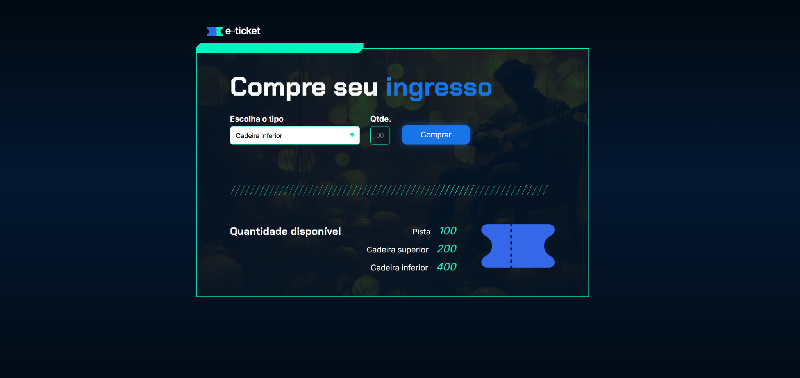
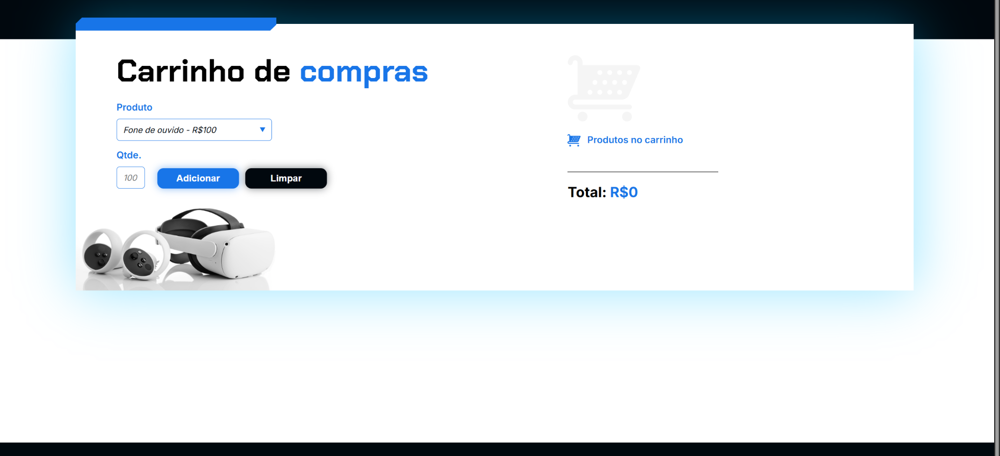
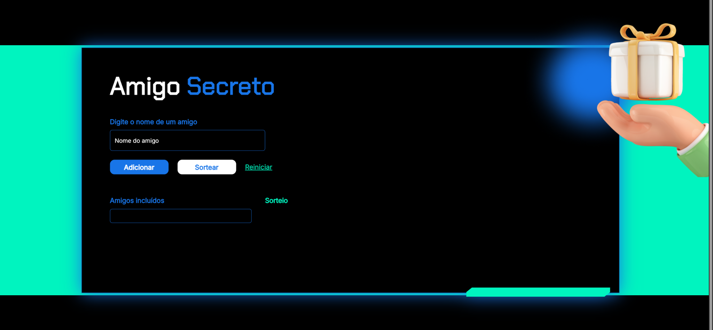
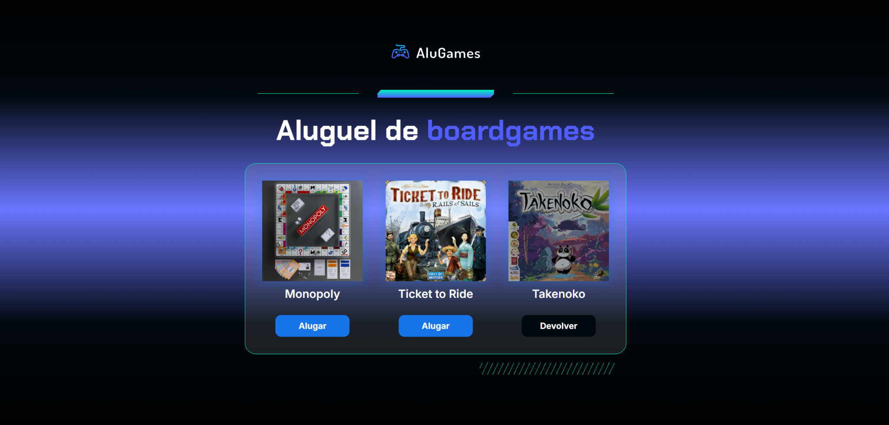

# 🧩 Praticando Lógica de Programação

Repositório criado para reunir os projetos desenvolvidos durante os cursos da **Alura**, com foco em **lógica de programação** e **fundamentos de JavaScript**.
Cada projeto explora conceitos essenciais de variáveis, condicionais, funções, laços de repetição e manipulação de arrays, sempre aplicados de forma prática e interativa.

---

## 💡 Projetos

### 🎟️ Ingresso Online
Simula a compra e controle de ingressos de eventos, aplicando conceitos de variáveis, funções e estruturas condicionais.

**Conceitos de Lógica e JavaScript:**
* **Funções:** Organização do código em funcionalidades separadas.
* **Condicionais (`if`):** Determinar qual função chamar com base em variáveis.
* **Tipos de Dados:** Uso de `parseInt()` para conversão de `String` para número inteiro.

---

### 🛒 Carrinho de Compras
Exercício para praticar arrays, laços e soma de valores. O programa adiciona e remove produtos, e calcula o total da compra.

**Conceitos de Lógica e JavaScript:**
* **Manipulação de DOM:** Uso de `value` e `innerHTML` para recuperar e modificar elementos na página.
* **Strings:** Utilização das funções `split()` para separar trechos de texto.
* **Template String:** Concatenação eficiente de variáveis em strings para exibição.

---

### 🎲 Sorteador de Números
Gera números aleatórios de forma dinâmica, explorando funções e manipulação de elementos da página.

**Conceitos de Lógica e JavaScript:**
* **Controle de Fluxo:** Estrutura de repetição `for` para geração de números aleatórios e controle de sorteio.
* **Arrays:** Declaração, manipulação e adição de elementos com `push()`.
* **Manipulação de DOM e CSS:** Uso de `classList.contains()`, `classList.remove()`, e `classList.add()` para alterar o estilo (status) de botões.
* **Funções:** `document.getElementById()`, `parseInt()`, e uso de bibliotecas externas para sorteio.

---

### 🎁 Amigo Secreto
Programa que sorteia automaticamente os pares de amigo secreto, aplicando lógica condicional e manipulação de listas.

**Conceitos de Lógica e JavaScript:**
* **Arrays (Listas):** Declaração, adição de elementos (`push`), obtenção do tamanho (`length`) e checagem de existência (`includes`).
* **Validações:** Uso de condicionais para validar informações e impedir sorteios inválidos.
* **Controle de Fluxo:** Interrupção de função com `return`.
* **Bibliotecas:** Utilização de código de terceiros para realizar o embaralhamento (shuffle) de um array.

---

### 🎮 AluGames
Simulação de uma loja de aluguel de jogos, praticando lógica, organização de código e manipulação de arrays de objetos.

**Conceitos de Lógica e JavaScript:**
* **Manipulação de DOM:** Uso de `querySelector()`, `getElementById()`, `textContent` para acessar e alterar o estado de elementos da página.
* **Condicionais (`if/else`):** Implementação da funcionalidade de alterar o status de um jogo entre "Alugar" e "Devolver".
* **Manipulação de CSS:** Uso de `classList.contains()`, `classList.remove()`, e `classList.add()` para aplicar e remover classes CSS que indicam o status de alugado/disponível.
* **Organização de Código:** Análise de estrutura HTML e planejamento da lógica JavaScript.

---

## 🧠 Tecnologias Utilizadas
- HTML
- CSS
- JavaScript

---

## ✨ Objetivo
Esses projetos fazem parte da minha jornada de aprendizado na **Alura**, com o objetivo de aprimorar minha **lógica de programação** e consolidar a base para o desenvolvimento front-end, aplicando conceitos como: **variáveis, funções, condicionais, laços de repetição, arrays e manipulação do DOM**.

---

## 📫 Contato
📧 [rafaelatf@gmail.com](mailto:rafaelatf@gmail.com)
🌐 [linkedin.com/in/rafaelatf](https://linkedin.com/in/rafaelatf)
